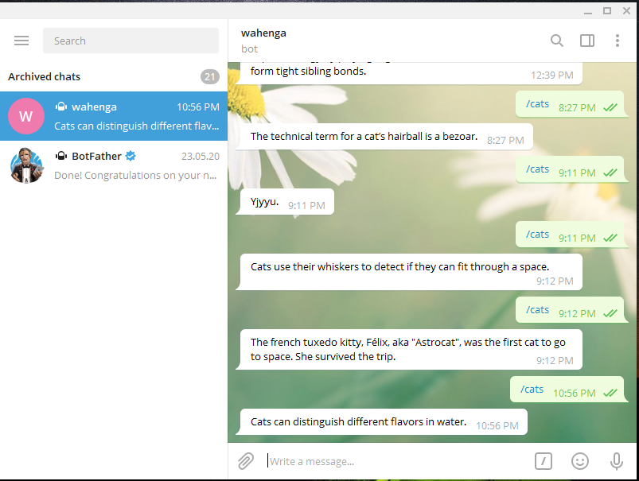

# capstone_telegram_bot_cats_facts

# What it does
In this project, am creating a telegram bot with the name @wahenga, where each time logs in to their telegram account and search for @wahenga and type in /cats, one will get a random text that contains a fact about the cats.

## Built With
- Ruby
- VScode
- cat-fact.herokuapp.com/facts
- Telegram Bot API
#### and deployed to Github

## Getting Started
- Create a telegram account
- Install Ruby. If you don't know how to install Ruby, you can read this [documentation](https://www.ruby-lang.org/en/documentation/installation/?ref=hackernoon.com)
- Obtain a token number from Telegram with the help of the bot father
- Initialize a Ruby Gemfile by running bundle init
- Add gem 'telegram-bot-ruby', gem  'json' and gem 'net-http-persistent', '~> 2.9', '>= 2.9.4'
- Run bundle install to install the dependencies
- Create main.rb in the bin folder to initialize our bot
- Create a class called Bot inside telegram_bot.rb in the lib folder which should contain the Ruby wrapper for Telegram's Bot API
- Create a class called Cats inside cats_facts.rb in the lib folder which is responsible for making requests to the API Endpoint
- Initialize our bot by running ruby bin/main.rb on your terminal
- Search for @wahenga(our bot)in your telegram account and type in /cats as shown below:

## Author

👤 **Ritta Buyaki**

- Github: [@Buyaki01](https://github.com/Buyaki01)
- Twitter: [@BuyakiRitta](https://twitter.com/BuyakiRitta)
- Linkedin: [Ritta Buyaki](https://www.linkedin.com/in/ritta-buyaki-b12904128/)

## 🤝 Contributing

Feel free to check the [issues page](https://github.com/Buyaki01/capstone_telegram_bot_cats_facts/issues).

## Attributions and Credit
Special thanks to Microverse!

## Show your support

Give a ⭐️ if you like this project!

## 📝 License

This project is licensed by Microverse.

### Enjoy!